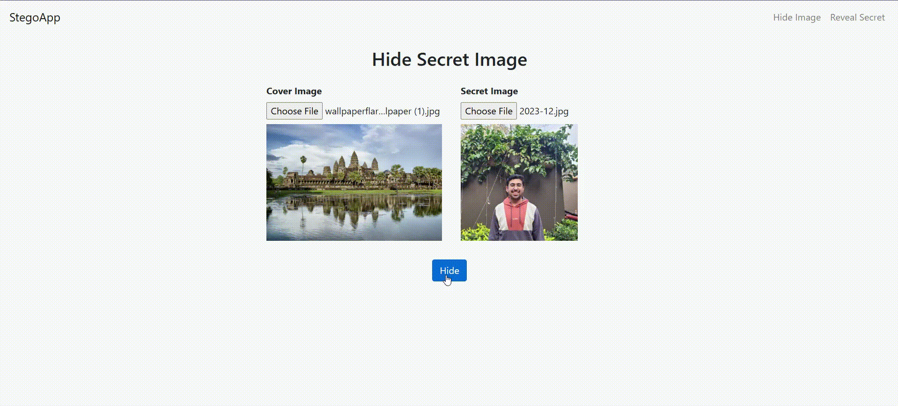
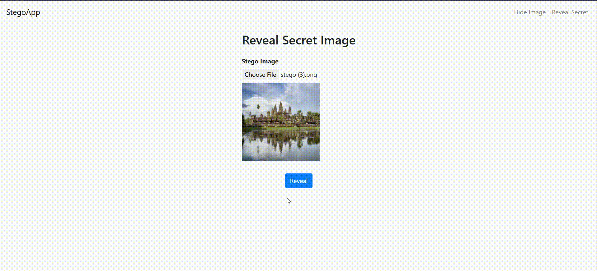
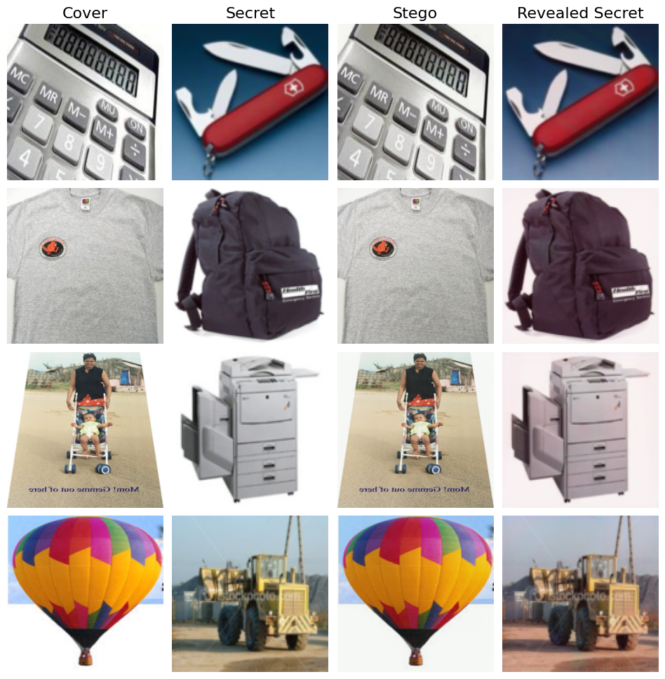
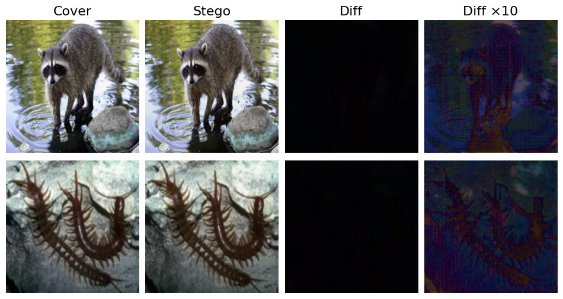

# Deep-Multimedia-Steganography

In the digital age, safeguarding private data and making sure communications are secure have become more and more crucial. One technique to conceal confidential information in cover media is through steganography, which is the art of embedding information in a way that is invisible to the naked eye.

My system follows the triple model steganographic pipeline of Preparation, Hiding, and Revealing, as originally proposed in the paper "Hiding Images in Plain Sight: Deep steganography". Each sub-network plays a distinct role:

- Preparation Network: Transforms the secret image into a form that is acceptable for hiding, by expanding it to match the spatial resolution of the cover.
- Hiding Network: Takes the cover image and the prepared secret, fuses them via a U-Net–style encoder–decoder with skip-connections, and outputs a visually indistinguishable stego image.
- Revealing Network: Extracts the hidden secret image from a stego image, collapsing it back to the secret’s original resolution.

## Installation

1. **Clone the Repository**:
    ```bash
    git clone https://github.com/vardanskamra/Deep-Multimedia-Steganography
    cd Deep-Multimedia-Steganography

2. **Create a Virtual Environment**:
    ```bash
    python -m venv venv
    ```

    On macOS/Linux:
    ```bash
    source venv/bin/activate
    ``` 

    On Windows:
    ```bash
    venv\Scripts\activate
    ```

3. **Install Python Dependencies**:
    ```bash
    pip install -r requirements.txt
    ```

## Running the Web Application

- **Start the Server**:
    ```bash
    python src\app.py
    ```

- **Access the Application**: Once the server is running, access the application by opening a web browser and navigating to `http://localhost:5000`.

- **Upload the Cover and Secret Images and Download the Stego Image**: 
    

- **Upload the Stego Image and Download the Revealed Image**
    

## Model Performance 

The final model achieves a mean PSNR of 33.7 dB and SSIM exceeding 0.95 for the cover–stego pair. The model demonstrates a normalized correlation (NC) of up to 0.99 for the secret–revealed pair.

- **Visual Performance**: 
    

    Minimizing the difference between Cover and Stego was the main priority. You can see, there is no visual difference between the cover and stego images.

- **Visual Performance with Enhanced Difference**: 
    

    Even after enhancing the difference 10 times, there is no sign of secret leaking.